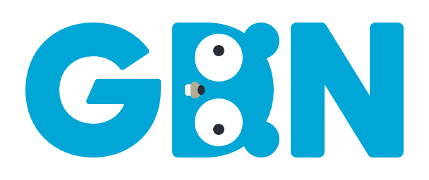

<!-- Featured photo for event -->

<!-- Title for event -->
#### [GDN Event] Learning Go - Tips for Gophers at All Levels

<!-- Time and date of event. Please adjust time to match the respective timezone -->
**Date and Time**: January, 27 2021 @ 1:00 PM EST (GMT/-5)

**Duration**: 3 Hours

<!-- Event Description -->
**Description**

We are extremely excited to announce our first GDN Event - a Learning Go - Tips for Gophers at All Levels, following the outpouring of desire for guidance on learning resources and tips we heard from the community during GopherCon 2020.

Learn how your fellow Gophers learnt Go, are continuing to learn, as well as getting some recommended learning resources.

The event will be hosted by Angelica Hill, and Wilken Rivera. It will feature a range of wonderful speakers from across the community, and across the world, speaking about what they’ve found helpful learning, resources they recommend, as well as tips & tricks when learning Go.

All the chatter during the event will be in the #learngomeetup Slack channel in Gophers slack.

**Agenda**:
* 1:00 - 1:20PM (GMT/-5) Introductions
* 1:20 - 3:00PM (GMT/-5): Featured Talks
* 3:00 - 3:20PM (GMT/-5): Open discussion with the speakers
* 3:20 - 3:40PM (GMT/-5): Event Wrap-up

<!-- Featured Speakers posted on main meetup page --> 
**Featured Speakers**:
* Talk 1: exercism.io - One Platform, Three Perspectives

In their talk Nils will investigate the Exercism platform from three different perspectives: As a mentee, as a mentor, and as a team in times of remote work. Nils will describe the experience of teaching on Exercism as well as share their insights gained from using the platform as a tool for remote coding dojos.

Speaker: Nils Müller, "Real - Digital Payment & Technology Services GmbH", Platform Engineer

* Talk 2: Journey Before Destination

For many of us, learning to program is a means to an end. We want to get a job, to get paid, or to build a specific app. The end result is that we often try to skip to the end. We want to build "modern" apps, to write idiomatic code from the start, and we don't want to waste time learning the "wrong" way to do things. In this talk Jon explores the importance of resisting the temptation to try to skip ahead, and why it is important to focus on the learning journey rather than a specific destination.

Speaker: Jon Calhoun, Creator of Gophercises

* Talk 3: GoBridge mentoring, workshops, and everything in between.

In this talk Bill will share GoBridge initiatives, and ways for the community to get involved.

Speaker: Bill Kennedy, GoBridge Founder

* Talk 4: So you've completed the Tour of Go - what next?

The Tour of Go gives an excellent introduction to Go the language. But where do you go next? You need to understand the go command to take those next steps. Wouldn't it be great if you could work through some interactive guides online, without having to set up anything on your computer?

In this talk Paul will introduce play-with-go.dev a series of hands-on, interactive, browser-based guides, demonstrate the user experience, and talk about how people can contribute guides to the platform as well.

Speaker: Paul Jolly, creator of play-with-go.dev

* Talk 5: Learning Go through Open Source

Programming languages require practice, patience, and tons of application. But that doesn’t mean you have to do it in isolation. In this talk Wilken will share his journey to learning Go through open source, and share how contributing to open source projects can be a platform for learning at all levels

Speaker: Wilken Rivera, HashiCorp, Sr. Software Engineer

* Talk 6: Anyone can be a Gopher! (My GopherCon Talk)

This will be a video played during the meetup: https://www.youtube.com/watch?v=WNBzMtIaXwE&t=31s

This talk outlines my motivation, and struggles, to master coding and achieve Go competency during my first year working at The New York Times – with the help of several Go Gurus.

Speakers: Angelica Hill, New York Times, Associate Product Manager

* Talk 7: Adrien Delorme: His Go story going from C++ to Go, and his way of learning more Go.

From software engineering for embedded systems, video-games, Web, and then to the cloud. In this talk Adrien shares his journey to Go as a C++ game developer to becoming an open source maintainer and Go enthusiast.

Speaker: Adrien Delorme, HashiCorp, Sr. Software Engineer