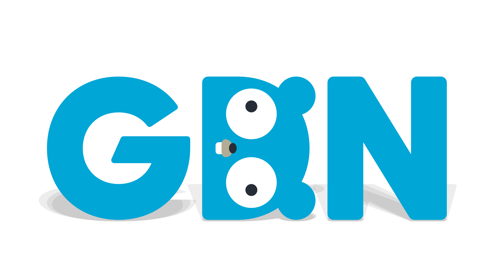

<!-- Featured photo for event -->

<!-- Title for event -->
#### [GDN Event] Going Cloud - A GCP and Go story

<!-- Time and date of event. Please adjust time to match the respective timezone -->
**Date and Time**: March, 17 2021 @ 1:00 PM EST (GMT/-5)

**Duration**: 4 Hours

<!-- Event Description -->
**Description**
We are extremely excited to announce our second GDN event Going Cloud - A GCP and Go story.

As more and more applications Go to the cloud, we can’t help notice how often Go is the language of choice for newly created applications and tooling. In this event we will be hearing stories from the community on how they took Go to the clouds with GCP.

The Meetup will be held on Wednesday 17th March from 1pm - 4pm EST (GMT/-5), and hosted by Angelica Hill of GolangNYC, and Wilken Rivera of Go-Miami. It will feature a range of wonderful speakers from across the community, and across the world, speaking about Going Cloud - A GCP and Go story.

All the chatter during the event will be in the #gogcpmeetup Slack channel in Gophers slack.

Agenda:
* 1:00 - 1:20PM (GMT/-5) Introductions
* 1:20 - 4:20PM (GMT/-5): Featured Talks
* 4:20 - 4:40PM (GMT/-5): Event Wrap-up

Featured Talks:

Talk 1: Go and Google App Engine

In this presentation I'll show a couple of GAE apps along with the use of GCP logs, metrics, and profiling to monitor and debug the apps.

One app will have a goroutine leak we can see with profiling; we'll also use profiling to see the CPU & memory use of the second app. We'll add OpenCensus metrics in the second app as well as show how to correlate logs with the GCP trace ID we get in each request header.

Folks will also see how to create & deploy simple GAE apps in Go.

The code will be available at https://github.com/matt4biz/go-gae-example

Speaker: Matthew Holiday - Senior Gopher, The New York Times

Talk 2: Go webapp serverless options in GCP

We're spoiled for choice: App Engine, Cloud Functions, Cloud Run... let's see what the experience looks like, and which one to choose for your use case. By the way, what does Serverless even mean in practice?

Speaker: Valentin Deleplace - Senior Developer, Google

Talk 3: Gotchas using Go to reduce the spread of COVID

The Apple+Google Exposure Notifications project makes heavy use of Go for the server-side components. In this talk, Seth will highlight some of the gotchas, mistakes, and bugs that we identified in building an operating a global system serving millions of users daily.

Speaker: Seth Vargo, Engineer at Google Cloud

Talk 4: Go, Cloud Functions and Cloud Tasks

How I used Cloud functions to scale up GCP instances in advance of push notifications sent to NYT users. How Cloud Tasks are used to trigger the scaling down.

Speaker: Fred Gurnot, Senior Software Engineer, The New York Times

Talk 5: From Python to Go on GCP

Khan Academy is moving from a Python 2 Monolith to Go Services, using GraphQL to save time and money. For GraphQL mutations we use canaries, and for queries we use traffic shadowing to safely make an incremental switchover.

Speaker: Steve Coffman, Senior Backend Engineer at Khan Academy

Talk 6: Implementing and Deploying a Cloud Function in Go.

DESCRIPTION - In my presentation, I will walk through the process of writing and deploying a cloud function in Go. I will talk through the authentication options and the deployment parameters, as well as a couple of real-life use cases for cloud functions that my team has worked with.

Speaker: Misha Avrekh, Software Engineer, The New York Times

