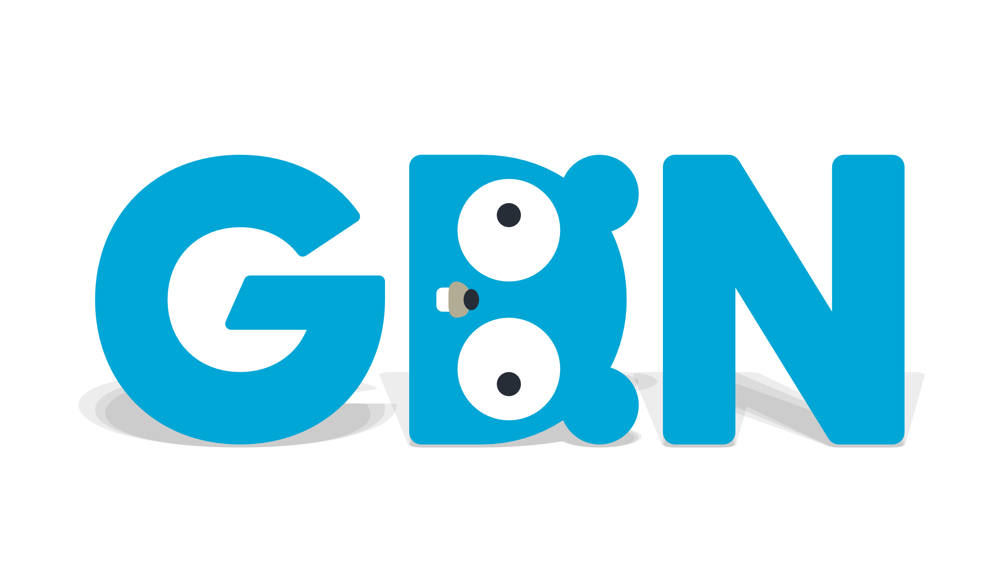

<!-- Featured photo for event -->

<!-- Title for event -->
#### [GDN Event] Glorious Go Gals: wonderful womxn talking about their work in Go

<!-- Time and date of event. Please adjust time to match the respective timezone -->
**Date and Time**: May 21, 2021 @ 5:00 PM UTC

**Duration**: 3 Hours

<!-- Event Description -->
**Description**
We are extremely excited to announce our third GDN Event - Glorious Go Gals: a collection of wonderful womxn talking about their work in Go. During the event you will hear from a range of different womxn across the Go community, as well as across the world. They will be speaking about a range of topics from best practices for log aggregation and centralization and testing, to Crypto Fails and how to Tackle Them in Go.

The Meetup will be held on Friday May 21st 5pm - 8pm UTC (1pm - 4pm EST, 10am - 1pm PST) and hosted by Angelica Hill, and Wilken Rivera. All talks will be recorded and streamed on the GDN YouTube Channel https://youtube.com/c/GoDevNet

All the chatter during the event will be in the #gloriousgogals Slack channel in Gophers slack. Not on Slack signup at https://gophers.slack.com/

Agenda:
* 5:00 - 5:20PM (UTC) Introductions
* 5:20 - 7:10PM (UTC): Featured Talks
* 8:10 - 8:20PM (UTC): Event Wrap-up

Featured Talks:

\* Talk 1: Some practices for logs aggregation and centralization
Speaker: Diana Ortega, Software developer at Publicis Sapient France

When we write applications, we generate logs to help us diagnose problems, monitor performance, understand user behaviour, etc.But, are there strategies or good practices for taking the best of them, especially when my application runs in a distributed environment?

In this talk, I'm going to show some techniques to produce logs, aggregate them using a log aggregation system and then use dashboards to analyze those logs.
For that, We’ll need to go beyond the standard library, and we’ll be using tools like promtail, fluentbit, loki and grafana.

\* Talk 2: Crypto Fails and How to Tackle Them in Go
Speaker: Anna-Katharina Wickert, PHD Student, Technische Universität Darmstadt

Recent studies in academia and industry reveal that the (vast) majority of applications using crypto struggle with a functional and secure solution. Because of these struggles, the application ends up with attackable components, e.g., passwords stored insecurely. Further, these issues can lead to messages like: “Our application is secure as it uses the standard AES.” However, it is attackable as the wrong parameters for the AES encryption were chosen.

In this talk, we will introduce and explain six very frequently discussed problems for insecure crypto usages and demonstrate secure solutions for common use cases. We will start by understanding why these six issues are a security problem without using any mathematical formula at all. After knowing why we should avoid these mistakes in our application, we take a look at the standard Go crypto library and inspect if we can repeat finding these issues in implementations using this library as well. A small spoiler: You can’t repeat all due to the design decisions of the Go crypto API. We will end the talk with code examples of common tasks involving crypto.

\* Panel Discussion with Jessica Greene, Natalie Pistunovich, and Ronna Steinberg - All Glorious Gophers based in Berlin

\* Talk 4: Simplicity of testing using GoLang
Speaker: Thilak Subramanian, Lead Software Engineer.
